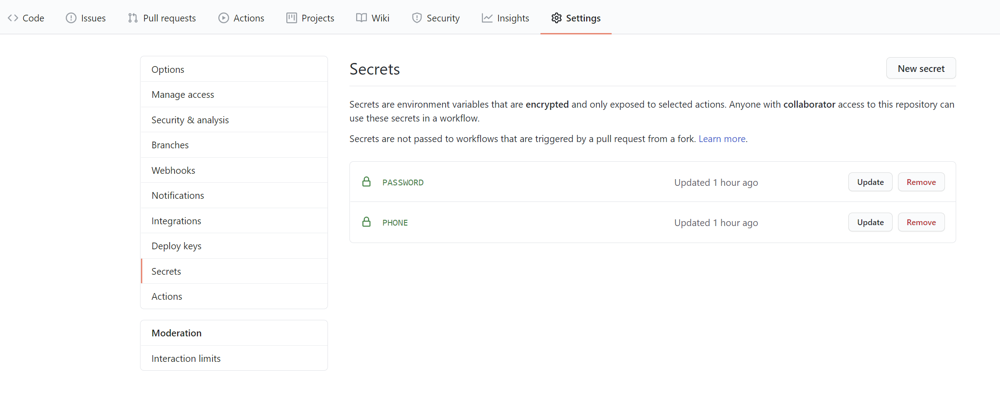

# CloudMusic-LevelUp

> 网易云音乐刷歌升级脚本
>
> [项目 GitHub 地址](https://github.com/Secriy/CloudMusic-LevelUp)

## 脚本功能

1. 登录网易云音乐
2. 执行签到，并显示奖励的积分数值
3. 刷音乐播放量，返回具体数值
4. 使用 GitHub Actions 挂脚本

## 使用方式

### 安装依赖

```shell
pip install -r requirements.txt
```

### 执行脚本

脚本使用命令行参数输入变量

```shell
python action.py 手机号 32位MD5密码加密值
```

密码的 MD5 值计算可以在[MD5 在线加密](https://md5jiami.51240.com/)上进行，取 32 位小写值


执行结果：


因为我今天已经刷满了，所以就不累计听歌量了。

### 自定义歌单

鉴于网易云每天推荐的歌单不太够，就增加了自定义歌单的功能，也是使用参数的形式，支持多个歌单输入，例如：

```shell
python action.py 手机号 32位MD5密码加密值 5173689994 4901511925
```

## GitHub Actions 部署

### 1. Fork 该仓库

### 2. 创建 Secrets

创建 PHONE，填入手机号

创建 PASSWORD，填入 32 位 MD5 密码加密值



### 3. 启用 Action

点击 Actions，选择 **I understand my workflows, go ahead and enable them**

**每天 0 点会自动执行一次脚本**


## 注意事项

- 网易云音乐限制每天最多计算 300 首
- 脚本每次限制最多 340 首，反复刷没什么用处

## TODO:

这种刷歌的方式不太好，每次推荐的四个歌单似乎不到 300 首，以后有时间再改吧。
