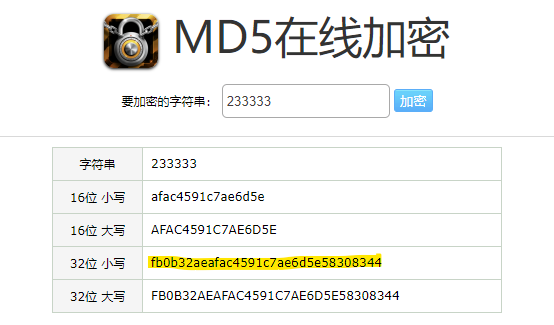
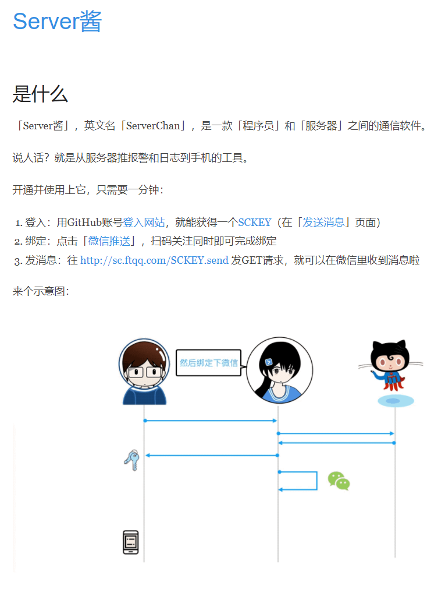
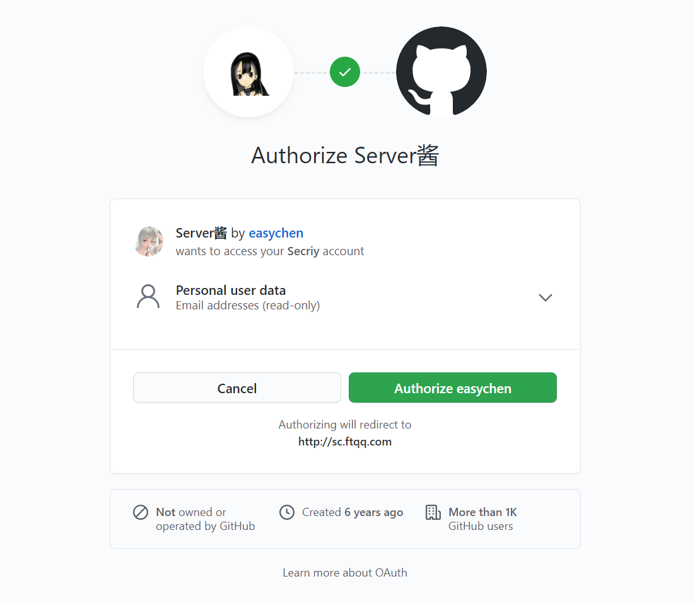
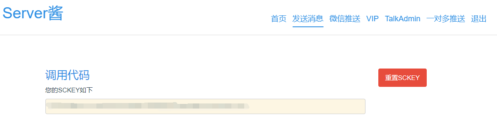
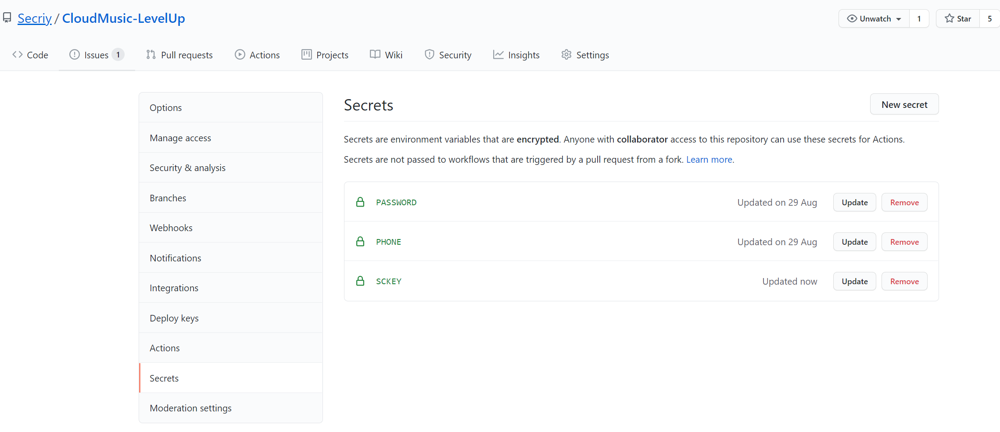
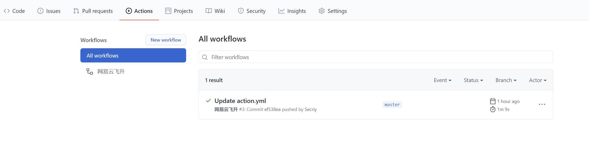
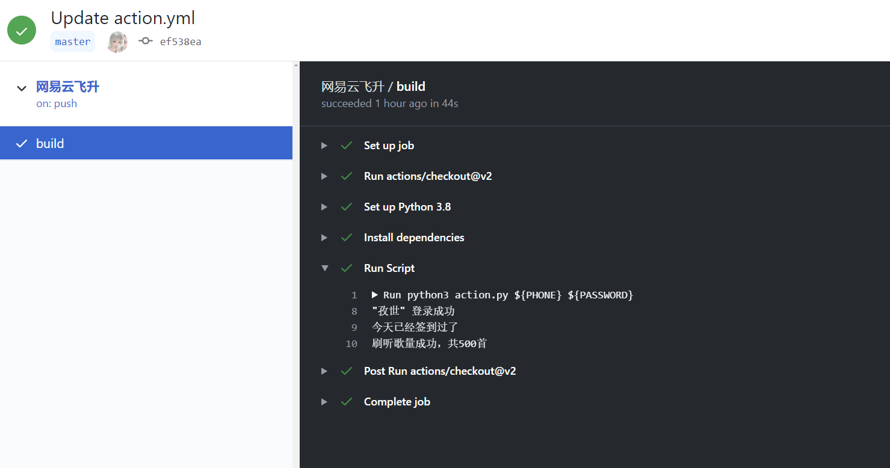
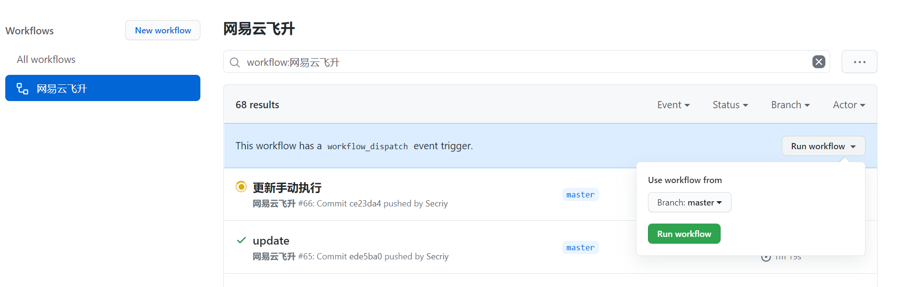

# CloudMusic-LevelUp

> 网易云音乐刷歌升级脚本
>
> [项目 GitHub 地址](https://github.com/Secriy/CloudMusic-LevelUp)

## 脚本功能

1. 登录网易云音乐
2. 执行签到，并显示奖励的积分数值
3. 刷音乐播放量，返回具体数值
4. 使用 GitHub Actions 挂脚本

## 使用方式

### 安装依赖

```shell
pip install -r requirements.txt
```

### 执行脚本

脚本使用命令行参数输入变量，其中手机号和密码的32位MD5值为必填字段，其余均为可选字段。

```shell
# python action.py -h 查看usage
usage: action.py [-h] [-s SCKEY] [-l [PLAYLIST [PLAYLIST ...]]] phone password

positional arguments:
  phone                 your Phone Number
  password              MD5 value of the password

optional arguments:
  -h, --help            show this help message and exit
  -s SCKEY              SCKEY of the Server Chan
  -l [PLAYLIST [PLAYLIST ...]]
                        your playlist
```

示例：

```shell
python action.py 10000000000 4******************************1 -s SSS111111T111112f3e42e111172a041111a11130451115b5111d11 -l 2133132 2311315 2434234
```


密码的 MD5 值计算可以在[MD5 在线加密](https://md5jiami.51240.com/)上进行，取 32 位小写值



执行结果：


因为我今天已经刷满了，所以就不累计听歌量了。

### 自定义歌单

鉴于网易云每天推荐的歌单不太够，就增加了自定义歌单的功能，也是使用参数的形式，支持多个歌单输入，例如：

```shell
# 必须添加-l指定参数
python action.py 手机号 32位MD5密码加密值 -l 5173689994 4901511925
```

### Server 酱微信推送



Server 酱可以绑定微信，将脚本每次的运行结果推送到你的微信上。

使用方法：

1. 访问[Server 酱官网](http://sc.ftqq.com/3.version)，点击**登入**，关联 GitHub 账号

   

   

2. 登入成功后，点击**微信推送**按照网站上的步骤关注公众号，并验证

3. 点击**发送消息**，找到自己的调用代码，并复制

   

4. 执行脚本时带参数`-s`指定调用代码

   用例：

   ```shell
   python action.py 手机号 32位MD5密码加密值 -s 调用代码
   ```

## GitHub Actions 部署

### 1. Fork 该仓库

### 2. 创建 Secrets

- 创建 PHONE，填入手机号（必填）

- 创建 PASSWORD，填入 32 位 MD5 密码加密值（必填）

- 创建 SCKEY（Server 酱调用代码，可选）



### 3. 启用 Action

点击 Actions，选择 **I understand my workflows, go ahead and enable them**

真的是过了很久之后才发现**由于 GitHub Actions 的限制，直接 fork 来的仓库不会自动执行！！！**

必须手动修改项目提交上去，最简单的方法就是修改下图的 README.md 文件（右侧有网页端编辑按钮）。


随便修改什么都行，修改完 commit 就可以了。

之后**每天 0 点**会自动执行一次脚本





### 4.手动执行

GitHub 现在有了手动执行的功能，点击下图 Run workflow 即可。



## 注意事项

- 网易云音乐限制每天最多计算 300 首
- 必须手动修改内容，不然不会自动执行！
- 脚本使用GitHub Actions部署时不支持自定义歌单

## TODO:

这种刷歌的方式不太好，每次推荐的四个歌单似乎不到 300 首，以后有时间再改吧。
